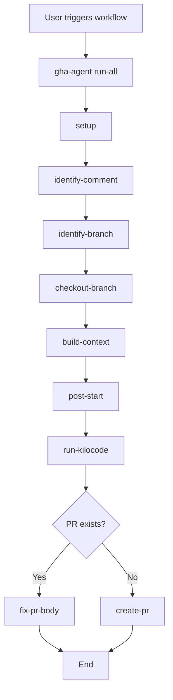

# GitHub Actions Workflow CLI Plan

## Overview

Extract the shell script operations from [`.github/workflows/kilocode.yml`](../.github/workflows/kilocode.yml) into a TypeScript CLI that can be called via API. This will simplify the workflow and make the functions reusable.

## Proposed CLI Commands

```
gha-agent <command> [options]
```

### 1. `gha-agent identify-comment`

Extract issue and PR numbers from a GitHub comment event.

**Options:**
- `--comment <string>` - The full comment body (required)
- `--issue-number <number>` - The issue/PR number from the event (required)

**Output:**
```json
{
  "issueNumber": "123",
  "prNumber": "456",
  "isPrComment": true
}
```

Extract issue and PR numbers from a GitHub comment event.

**Options:**
- `--comment <string>` - The full comment body
- `--issue-number <number>` - The issue/PR number from the event
- `--token <string>` - GitHub PAT token

**Output:**
```json
{
  "issueNumber": "123",
  "prNumber": "456",
  "isPrComment": true
}
```

**Workflow Equivalent:**
```yaml
# Lines 41-73
- name: Identify Issue and PR Numbers
```

**Implementation:**
- Determine if comment is on issue or PR using `gh pr view`
- Parse PR body for `closes #`, `fixes #`, `resolves #` patterns
- Check for existing PRs with branch `kilo-issue-<issueNumber>`

---

### 3. `gha-agent identify-branch`

Determine the working branch based on issue/PR context.

**Options:**
- `--issue-number <number>` - Issue number
- `--pr-number <number>` - PR number (optional)
- `--token <string>` - GitHub PAT token

**Output:**
```json
{
  "branchName": "kilo-issue-123"
}
```

**Workflow Equivalent:**
```yaml
# Lines 75-90
- name: Identify Branch
```

**Implementation:**
- If PR number provided: use PR's head branch name
- If only issue number: use `kilo-issue-<issueNumber>`
- Extract branch name using `gh pr view` or construct from issue number

---

### 4. `gha-agent checkout-branch`

Checkout the appropriate working branch.

**Options:**
- `--branch-name <string>` - Branch name to checkout
- `--pr-number <number>` - PR number (if applicable)
- `--token <string>` - GitHub PAT token

**Workflow Equivalent:**
```yaml
# Lines 92-109
- name: Checkout working branch
```

**Implementation:**
- Fetch all remote branches
- If PR exists: checkout and pull PR branch
- If branch exists remotely: checkout and pull
- Otherwise: checkout master, pull, create new branch

---

### 5. `gha-agent build-context`

Build comprehensive task context from issue/PR and comments.

**Options:**
- `--comment <string>` - The user command comment
- `--issue-number <number>` - Issue number
- `--pr-number <number>` - PR number (optional)
- `--token <string>` - GitHub PAT token
- `--agents-file <string>` - Path to AGENTS file (default: "AGENTS_GHA.md")

**Output:**
```json
{
  "branchName": "kilo-issue-123",
  "prNumber": "456",
  "task": "PR #456: Fix bug\n\nDescription...\n\nTASK: Fix the bug\n..."
}
```

**Workflow Equivalent:**
```yaml
# Lines 133-187
- name: Extract prompt
```

**Implementation:**
- Strip `/kilo` or `/kilocode` prefix from comment
- Fetch issue/PR title and body
- Collect all comments from issues and PRs
- Collect review comments on current commit
- Read project instructions from AGENTS file
- Combine all into unified task context

---

### 6. `gha-agent post-start`

Post a "started working" comment to issue or PR.

**Options:**
- `--issue-number <number>` - Issue number
- `--pr-number <number>` - PR number (optional)
- `--branch-name <string>` - Branch name
- `--run-url <string>` - Workflow run URL
- `--token <string>` - GitHub PAT token

**Workflow Equivalent:**
```yaml
# Lines 111-131
- name: Post start comment
```

---

### 7. `gha-agent fix-pr-body`

Fix literal `\n` strings in PR body to actual newlines.

**Options:**
- `--pr-number <number>` - PR number
- `--token <string>` - GitHub PAT token

**Workflow Equivalent:**
```yaml
# Lines 203-218
- name: Fix PR body newlines
```

---

### 8. `gha-agent create-pr`

Create a draft PR from the current branch.

**Options:**
- `--issue-number <number>` - Issue number
- `--branch-name <string>` - Branch name
- `--token <string>` - GitHub PAT token

**Output:**
```json
{
  "prNumber": "789"
}
```

**Workflow Equivalent:**
```yaml
# Lines 220-242
- name: Create PR if needed
```

**Implementation:**
- Push branch to origin
- Check if branch has commits
- Create draft PR with title "Fix: <issueTitle>" and body "Closes #<issueNumber>"

---

### 9. `gha-agent run-kilocode`

Execute the Kilo Code agent with task context.

**Options:**
- `--task <string>` - Task context (from `build-context`)
- `--auto` - Run in auto mode
- `--timeout <number>` - Timeout in seconds (default: 2000)
- `--model <string>` - LLM model to use
- `--token <string>` - GitHub PAT token

**Workflow Equivalent:**
```yaml
# Lines 189-201
- name: Run Kilo Code
```

---

### 10. `gha-agent run-all`

Execute the complete workflow as a single command.

**Options:**
- `--comment <string>` - The command comment
- `--issue-number <number>` - Issue number from event
- `--token <string>` - GitHub PAT token
- `--kilo-api-key <string>` - Kilo API key
- `--auto` - Run in auto mode
- `--timeout <number>` - Timeout in seconds

**Workflow Equivalent:**
Runs steps 1-9 in sequence.

---

## File Structure

```
workspaces/utils/packages/github-actions-agent/
├── bin/
│   └── gha-agent                 # CLI entry point
├── src/
│   ├── index.ts                  # Exports
│   ├── ghaAgent.ts               # Main agent class
│   ├── ghaAgentCli.ts            # CLI command definitions
│   ├── ghaAgentCliRun.ts         # CLI execution
│   ├── commands/
│   │   ├── setup.ts
│   │   ├── identifyComment.ts
│   │   ├── identifyBranch.ts
│   │   ├── checkoutBranch.ts
│   │   ├── buildContext.ts
│   │   ├── postStart.ts
│   │   ├── fixPrBody.ts
│   │   ├── createPr.ts
│   │   ├── runKilocode.ts
│   │   └── runAll.ts
│   └── utils/
│       ├── git.ts
│       ├── github.ts
│       └── types.ts
├── package.json
└── tsconfig.json
```

## Dependencies

```json
{
  "dependencies": {
    "@goldstack/utils-cli": "^0.3.27",
    "yargs": "^17.5.1",
    "octokit": "^3.0.0",
    "source-map-support": "^0.5.21"
  }
}
```

## Environment Variables

All sensitive configuration via environment variables:

| Variable | Description | Required |
|----------|-------------|----------|
| `GITHUB_TOKEN` | GitHub PAT token | Yes |
| `KILOCODE_API_KEY` | Kilo Code API key | Yes |

Note: Git user configuration (`user.name`, `user.email`) is handled directly in the workflow, not in the CLI.

## Usage Examples

```bash
export GITHUB_TOKEN=your_token
export KILOCODE_API_KEY=your_kilo_key

# Run complete workflow
gha-agent run-all \
  --comment "/kilo fix the bug" \
  --issue-number 123 \
  --auto \
  --timeout 2000

# Build context only
gha-agent build-context \
  --comment "/kilo refactor this function" \
  --issue-number 456 \
  --pr-number 789

# Create PR from branch
gha-agent create-pr \
  --issue-number 123 \
  --branch-name kilo-issue-123
```

## API Integration

The CLI can be called via HTTP API:

```typescript
import { GitHubActionsAgent } from '@goldstack/utils-gha-agent';

const agent = new GitHubActionsAgent({
  token: process.env.GITHUB_TOKEN!,
  kiloApiKey: process.env.KILOCODE_API_KEY!,
});

const result = await agent.runAll({
  comment: "/kilo fix the bug",
  issueNumber: 123,
  auto: true,
  timeout: 2000,
});
```

## Mermaid: Command Flow



## Benefits

1. **Reusability**: Functions can be called from API or CLI
2. **Testability**: Each command can be unit tested
3. **Maintainability**: Clear separation of concerns
4. **Type Safety**: TypeScript interfaces for all inputs/outputs
5. **Consistency**: Unified error handling and logging
